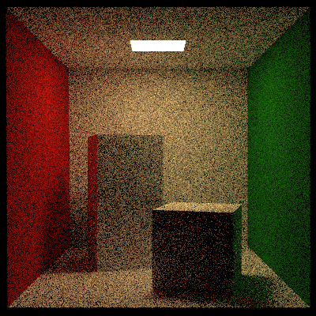
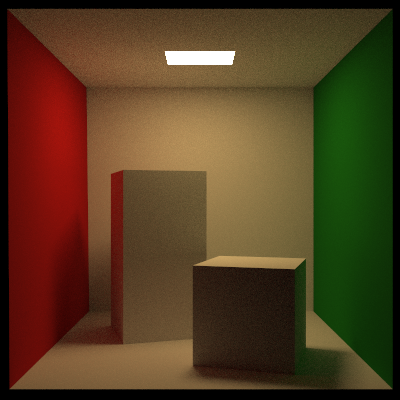
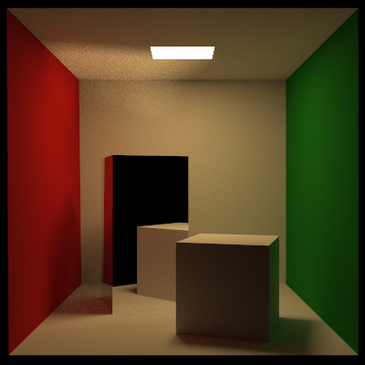

### Introduction

A simple C++ path tracer, with and without next event estimator (NEE).

### Dependencies

- C++20
- OpenMP (for parallel processing)

### Renders

Diffuse (Lambertian) tall block, image rendered without NEE.

Diffuse (Lambertian) tall block, image rendered with NEE.

Tall block is a dirac reflector, image rendered with NEE.

##### TODO:

Add multi importance sampling (MIS) to NEE.
